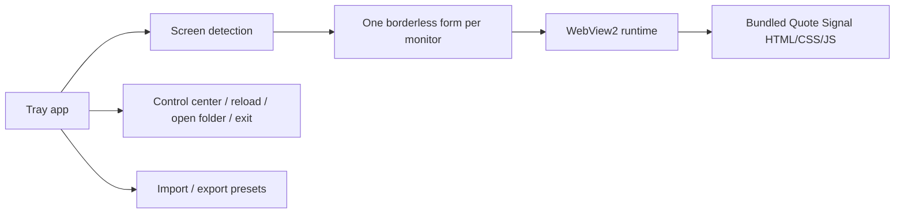

# Architecture

SignalWall is a small Windows desktop app that hosts web-based wallpapers.

## High-level flow



## Main pieces

- `src/SignalWall/Program.cs`: app entry point.
- `src/SignalWall/WallpaperAppContext.cs`: tray lifecycle and commands.
- `src/SignalWall/DesktopWorker.cs`: desktop-window attachment behavior.
- `src/SignalWall/WallpaperForm.cs`: borderless WebView2 wallpaper window.
- `src/SignalWall/ScreenSlotResolver.cs`: maps physical displays to screen slots.
- `src/SignalWall/ConfigStore.cs`: validates and atomically persists configuration.
- `src/SignalWall/ControlCenterForm.cs`: hosts the built-in control center.
- `src/SignalWall/web`: bundled Quote Signal wallpaper.

## Security model

SignalWall is local-first. The bundled wallpaper runs inside WebView2 and should remain inspectable as ordinary HTML/CSS/JS.

Current alpha constraints:

- Installer is unsigned.
- Source-first install is recommended.
- Any network behavior or startup persistence must be documented before release.
- Any installer script should be reviewed before use.

## Release model

The project can build an installer through GitHub Actions or locally through:

```powershell
powershell.exe -NoProfile -ExecutionPolicy Bypass -File .\scripts\build-installer.ps1
```

Until a signed installer exists, users should prefer local source review and local builds.

Every tagged release also includes SHA-256 checksums, an SPDX SBOM, a release manifest, and GitHub artifact attestations.
