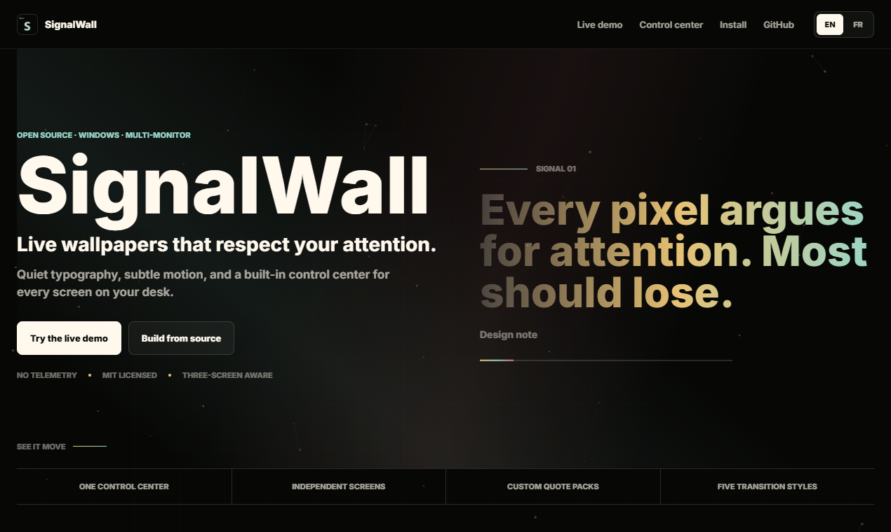

# SignalWall

English: [README.md](README.md)

<p align="center">
  
</p>

[](https://github.com/Sabertlili/signalwall/actions/workflows/ci.yml)
[](https://github.com/Sabertlili/signalwall/actions/workflows/codeql.yml)
[](https://github.com/Sabertlili/signalwall/actions/workflows/build-installer.yml)
[](LICENSE)
[](#prérequis)

SignalWall est une application Windows gratuite et open source pour des fonds d’écran dynamiques calmes, intentionnels et multi-écrans.

La version 0.2 ajoute un centre de contrôle intégré pour le rythme, le mouvement, l’ordre des écrans, les packs de citations et les thèmes de texte et de couleur. SignalWall crée une fenêtre WebView2 sans bordure par écran et rassemble tous les paramètres dans la barre système.

[Site web](https://nestcells.com) | [Prompt d’installation depuis la source](docs/ai-assisted-install.fr.md) | [Roadmap](ROADMAP.md) | [Architecture](ARCHITECTURE.md) | [Kit de lancement](docs/launch-kit.fr.md)

## Pourquoi ce projet existe

La plupart des fonds d’écran dynamiques sont conçus pour impressionner pendant cinq secondes. SignalWall est conçu pour l’écran que vous regardez toute la journée.

- Typographie calme au lieu de bruit visuel.
- Multi-écran traité comme un vrai workflow.
- Citations et thèmes personnalisables sans toucher au code.
- Installation depuis la source tant que l’installateur alpha n’est pas signé.

## Aperçu produit




<details>
<summary>Voir plus de captures</summary>

| Fond d’écran | Centre de contrôle |
| --- | --- |
|  |  |

| Workflow multi-écran |
| --- |
|  |

</details>

## Installation prudente avec Codex ou Claude Code

Le projet est gratuit et open source. Les binaires publics sont actuellement non signés et Windows Smart App Control peut les bloquer sur les systèmes stricts. Ne désactivez pas la sécurité Windows. Le chemin recommandé est de demander à Codex, Claude Code ou un agent équivalent d’inspecter le code source, de compiler localement, puis de présenter un rapport de sécurité avant de lancer l’application.

**[Copier le prompt d’installation depuis la source](docs/ai-assisted-install.fr.md)**

Ce prompt demande à l’agent de :

- cloner uniquement `https://github.com/Sabertlili/signalwall`;
- inspecter le code de l’application, le fond d’écran HTML inclus, les scripts et les GitHub Actions;
- vérifier les binaires de version publiée avec `Get-AuthenticodeSignature` et `Get-FileHash` si nécessaire;
- compiler depuis la source avec `dotnet restore` et `dotnet build`;
- ne pas désactiver Microsoft Defender, Smart App Control ou la sécurité du navigateur;
- expliquer ses conclusions avant de lancer l’application ou de construire un installateur local.

## Fonctionnalités actuelles

- Fenêtre de fond d’écran par moniteur.
- Centre de contrôle WebView2 intégré, accessible depuis la barre système.
- Rendu HTML/CSS/JS via WebView2.
- Quote Signal inclus comme fond d’écran par défaut.
- Même citation sur tous les écrans ou citation différente par écran.
- Thèmes texte globaux ou par écran.
- Thèmes couleur / arrière-plan globaux ou par écran.
- Ordre physique des écrans configurable.
- Durée par citation, taille du texte, particules, opacité de grille, barre de progression, ordre aléatoire et transitions.
- Thèmes clair et sombre pour le centre de contrôle.
- Création rapide de packs avec une phrase par ligne.
- Menu de barre système avec centre de contrôle, rechargement, dossier du fond d’écran, site web et fermeture.

## Prérequis

- Windows 10 ou Windows 11.
- SDK .NET 8 pour le développement.
- Microsoft Edge WebView2 Runtime.

La plupart des machines Windows 11 ont déjà WebView2. Si l’application ne peut pas démarrer WebView2, installez l’Evergreen Runtime de Microsoft.

## Build

```powershell
dotnet restore .\src\SignalWall\SignalWall.csproj
dotnet build .\src\SignalWall\SignalWall.csproj -c Release
```

## Lancer

```powershell
dotnet run --project .\src\SignalWall\SignalWall.csproj -c Release
```

Au premier lancement, SignalWall ouvre le centre de contrôle. Ensuite, utilisez **Open control center** dans le menu de la barre système.

## Publier localement

```powershell
dotnet publish .\src\SignalWall\SignalWall.csproj -c Release -r win-x64 --self-contained false -o .\publish\win-x64
```

## Confiance et sécurité

- Les installateurs alpha publics ne sont pas signés et peuvent être bloqués par Windows Smart App Control.
- Le projet prépare une candidature auprès de [SignPath Foundation](https://signpath.org/) pour obtenir gratuitement une signature Authenticode open source.
- Les artefacts de release incluent un checksum SHA-256 quand ils sont générés par le workflow d’installateur.
- CodeQL et CI tournent dans GitHub Actions.
- Dependabot suit les mises à jour NuGet et GitHub Actions.
- Voir [SECURITY.md](SECURITY.md), [docs/code-signing.md](docs/code-signing.md) et le [brouillon de candidature SignPath](docs/signpath-application.md).

## Contribuer

SignalWall reste petit volontairement. Les bonnes contributions améliorent la clarté, la sécurité, le multi-écran, la finition du wallpaper ou le chemin d’installation depuis la source.

Commencez par [CONTRIBUTING.md](CONTRIBUTING.md), [ROADMAP.md](ROADMAP.md) et [ARCHITECTURE.md](ARCHITECTURE.md).

## Licence

MIT. SignalWall est un projet clean-room et ne copie pas le code source de Lively Wallpaper.
