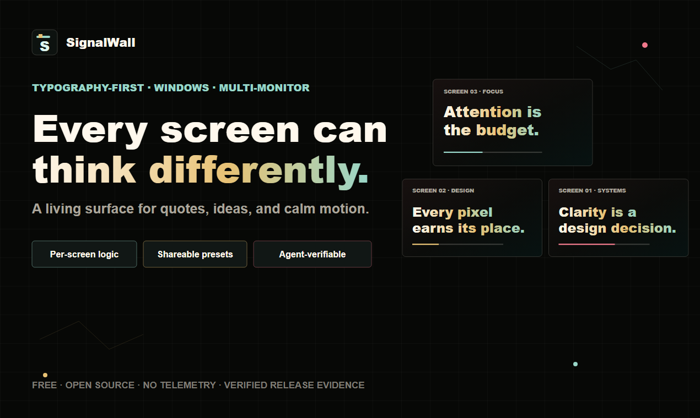
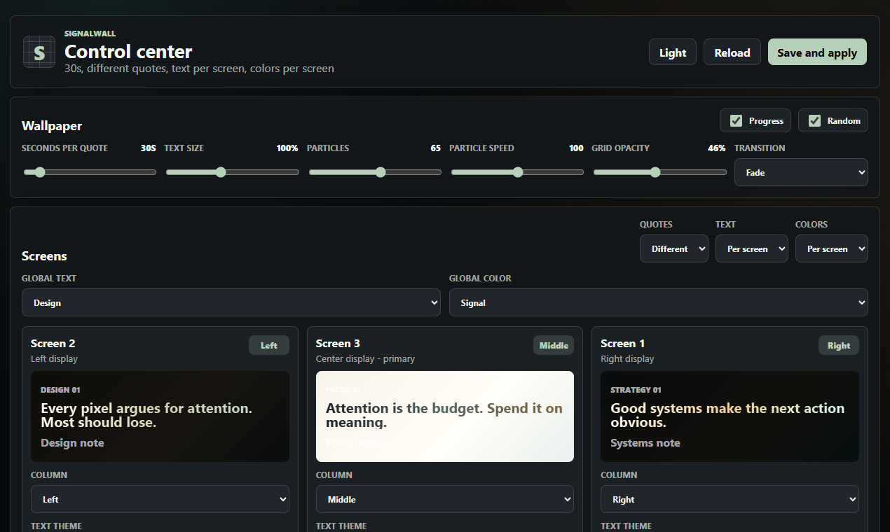

# SignalWall

Français: [README.fr.md](README.fr.md)

<p align="center">
  
</p>

[](https://github.com/Sabertlili/signalwall/actions/workflows/ci.yml)
[](https://github.com/Sabertlili/signalwall/actions/workflows/codeql.yml)
[](https://github.com/Sabertlili/signalwall/actions/workflows/build-installer.yml)
[](https://github.com/Sabertlili/signalwall/releases/latest)
[](LICENSE)
[](#requirements)

SignalWall is a free, open-source, typography-first live wallpaper system for Windows. It turns every monitor into an independent surface for quotes, ideas, and calm motion.

Version 0.3 adds shareable preset import/export, automated configuration tests, SPDX SBOMs, and cryptographically signed GitHub build provenance. SignalWall creates one borderless WebView2 wallpaper window per monitor and keeps the complete multi-screen setup in one control center.

[Website](https://nestcells.com) | [Latest release](https://github.com/Sabertlili/signalwall/releases/latest) | [Verify a release](docs/release-verification.md) | [Agent-verifiable install prompt](docs/ai-assisted-install.en.md) | [Roadmap](ROADMAP.md) | [Architecture](ARCHITECTURE.md)

## Why it exists

Most live wallpapers are image-first or video-first. SignalWall is typography-first: the words, hierarchy, rhythm, and relationship between screens are the product.

- Run one thought across every display or give each screen its own role.
- Control quotes, text themes, color themes, timing, motion, and physical screen order.
- Create complete quote packs with one phrase per line.
- Export the entire workspace as a shareable preset.
- Use an agent-verifiable source workflow while public Windows binaries remain unsigned.

## Product preview





<details>
<summary>More product captures</summary>

| Wallpaper | Control center |
| --- | --- |
|  |  |

| Multi-screen workflow |
| --- |
|  |

</details>

## Agent-verifiable installation with Codex or Claude Code

SignalWall is free and open source. Public binaries are currently unsigned, and Windows Smart App Control can block them on strict systems. Do not disable Windows security. The recommended path is agent-verifiable: ask Codex, Claude Code, or another local coding agent to inspect the source, build locally, and report security findings before launching the app.

**[Copy the agent-verifiable source install prompt](docs/ai-assisted-install.en.md)**

That prompt tells the agent to:

- clone only `https://github.com/Sabertlili/signalwall`;
- inspect the app code, bundled HTML wallpaper, scripts, and GitHub Actions;
- check release binaries with `Get-AuthenticodeSignature` and `Get-FileHash` if needed;
- build from source with `dotnet restore` and `dotnet build`;
- avoid disabling Microsoft Defender, Smart App Control, or browser security;
- explain findings before running the app or building a local installer.

## Current features

- Multi-monitor wallpaper windows.
- Built-in WebView2 control center opened from the tray.
- WebView2-powered HTML/CSS/JS wallpaper rendering.
- Quote Signal bundled as the default wallpaper.
- Same quote across screens or different quotes per screen.
- Global or per-screen text themes.
- Global or per-screen color/background themes.
- Screen order mapping for left, center, and right monitor layouts.
- Quote timing, text size, particles, grid opacity, progress bar, random order, and transition effects.
- Light and dark control-center themes.
- One-phrase-per-line quote pack creation.
- Import and export of shareable preset files.
- Tray menu with control center, reload, wallpaper folder, website, and exit.

## Requirements

- Windows 10 or Windows 11.
- .NET 8 SDK for development.
- Microsoft Edge WebView2 Runtime.

Most Windows 11 machines already have WebView2 installed. If the app cannot start WebView2, install the Evergreen Runtime from Microsoft.

## Build

```powershell
dotnet restore .\tests\SignalWall.Tests\SignalWall.Tests.csproj
dotnet build .\src\SignalWall\SignalWall.csproj -c Release
dotnet test .\tests\SignalWall.Tests\SignalWall.Tests.csproj -c Release
```

## Run

```powershell
dotnet run --project .\src\SignalWall\SignalWall.csproj -c Release
```

On first launch, SignalWall opens the control center. Later, use **Open control center** from the tray menu.

## Publish locally

```powershell
dotnet publish .\src\SignalWall\SignalWall.csproj -c Release -r win-x64 --self-contained false -o .\publish\win-x64
```

## Trust and security

- Public alpha installers are unsigned and may be blocked by Windows Smart App Control.
- The project is preparing an application to [SignPath Foundation](https://signpath.org/) for free open-source Authenticode signing.
- Releases include SHA-256 checksums, an SPDX SBOM, a machine-readable manifest, and a local verification script.
- GitHub Actions signs build-provenance and SBOM attestations through Sigstore.
- Automated tests, CodeQL, and CI run through GitHub Actions.
- Dependabot tracks NuGet and GitHub Actions updates.
- See [release verification](docs/release-verification.md), [SECURITY.md](SECURITY.md), [docs/code-signing.md](docs/code-signing.md), and the [SignPath application draft](docs/signpath-application.md).

## Contributing

SignalWall is small on purpose. Good contributions improve clarity, safety, multi-monitor behavior, typography, wallpaper polish, or the agent-verifiable install path.

Start with [CONTRIBUTING.md](CONTRIBUTING.md), [ROADMAP.md](ROADMAP.md), and [ARCHITECTURE.md](ARCHITECTURE.md).

## License

MIT. SignalWall is a clean-room project and does not copy Lively Wallpaper source code.
