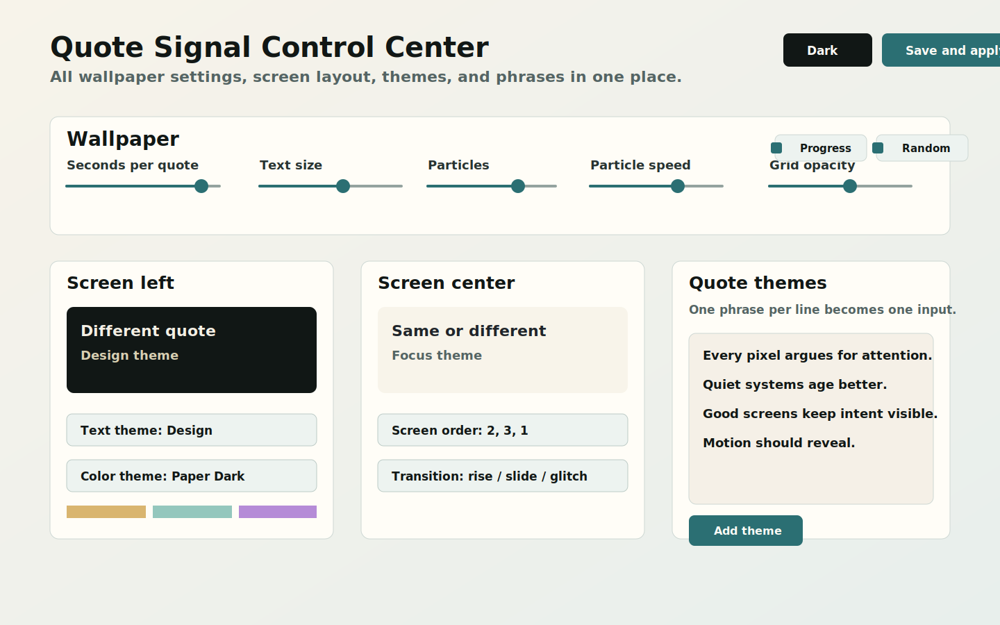
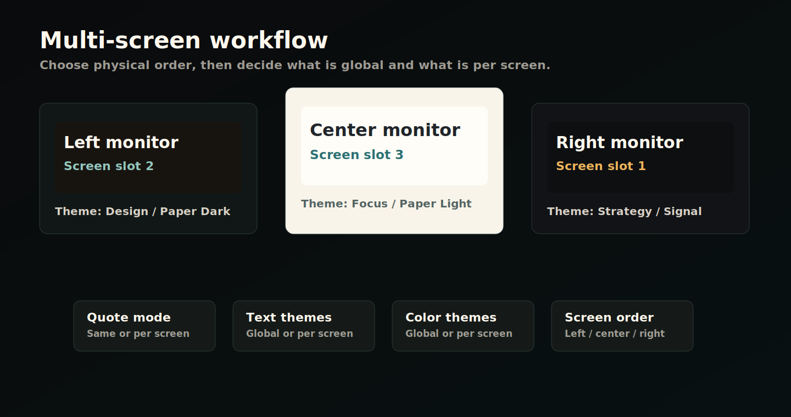

# AI-assisted source installation

SignalWall is free, open source, and early. The public Windows installer is currently **unsigned**, so the safest path is to have a local coding agent inspect the repository, build from source, and explain the security findings before anything runs.

Repository: `https://github.com/Sabertlili/signalwall`

## Copy this prompt

```text
You are my local coding agent on Windows. I want to install SignalWall from its open-source repository, but only after you review the source code and verify the build process.

Repository: https://github.com/Sabertlili/signalwall

Security rules:
- Do not disable Microsoft Defender, Smart App Control, browser protection, or any Windows security feature.
- Do not run the downloaded release EXE unless I explicitly approve it after you report its signature status.
- Prefer building from source over installing an unsigned downloaded binary.
- Stop and ask me before running any installer, elevated command, or long-running background process.

Verification checklist:
1. Clone the repository into a clean local folder.
2. Confirm the Git remote is exactly https://github.com/Sabertlili/signalwall.
3. Inspect the project structure, especially src/SignalWall, src/SignalWall/web, scripts, and .github/workflows.
4. Look for suspicious behavior: hidden downloads, credential access, persistence outside the tray app, unexpected network calls, destructive file operations, or commands that disable security tools.
5. Review the installer script before using it. Explain what it packages and whether it signs anything.
6. If a release EXE is present, run Get-AuthenticodeSignature and Get-FileHash on it, then explain the result in plain language.
7. Restore and build from source with:
   dotnet restore .\src\SignalWall\SignalWall.csproj
   dotnet build .\src\SignalWall\SignalWall.csproj -c Release
8. Summarize warnings, dependencies, and any security concerns before launching.
9. If the source looks acceptable, run:
   dotnet run --project .\src\SignalWall\SignalWall.csproj -c Release
10. If I ask for an installer, build it locally with:
   powershell.exe -NoProfile -ExecutionPolicy Bypass -File .\scripts\build-installer.ps1

Final output expected:
- A short security report.
- The exact commands you ran.
- A clear recommendation: run from source, build a local installer, or wait for a signed release.
```

## What the agent should verify

- **Origin**: the clone must come from `github.com/Sabertlili/signalwall`.
- **Source review**: app code, bundled wallpaper HTML, scripts, and workflows should be inspected before execution.
- **Dependencies**: SignalWall uses .NET 8 and WebView2. The agent should report restore/build warnings.
- **Installer status**: public alpha installers are unsigned unless a future release states otherwise.
- **Windows security**: the correct response to Smart App Control is not to bypass Windows blindly. Inspect and build from source, or wait for a signed release.

## Product captures





